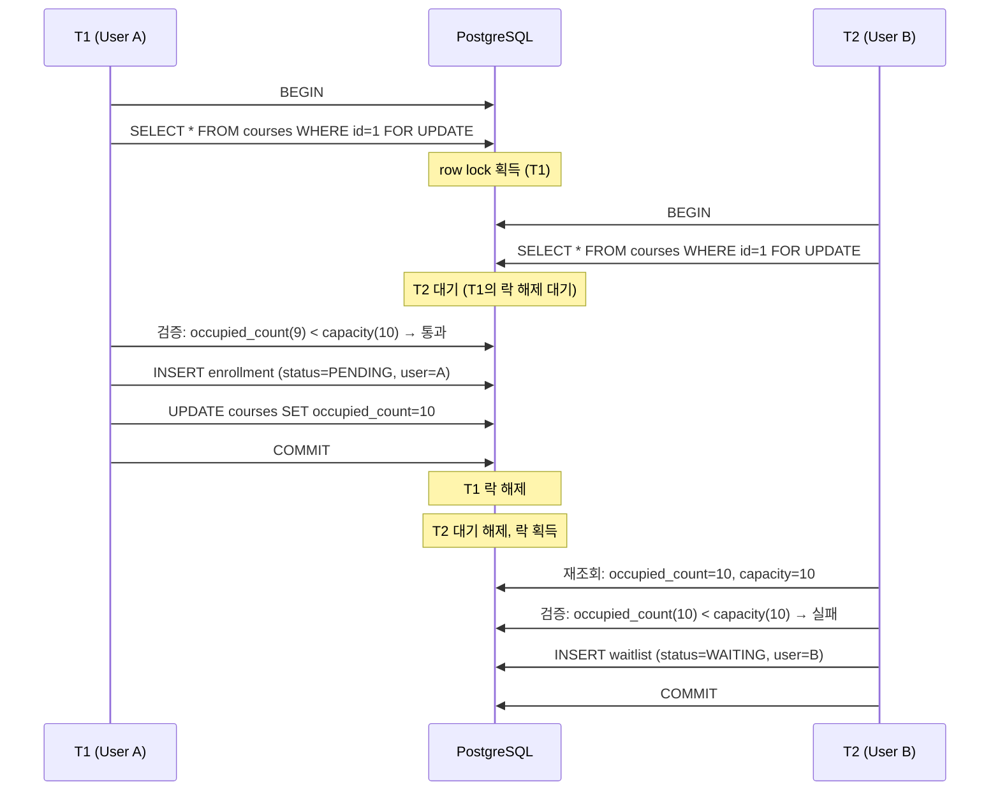
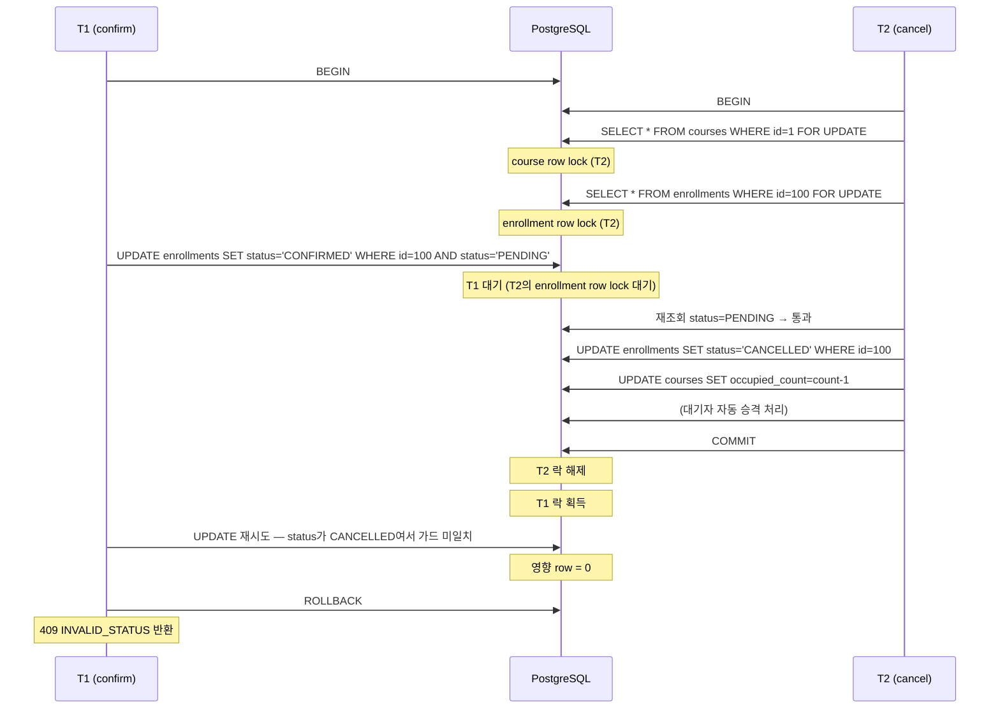
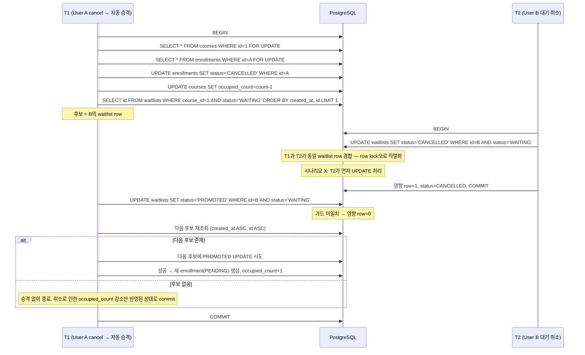
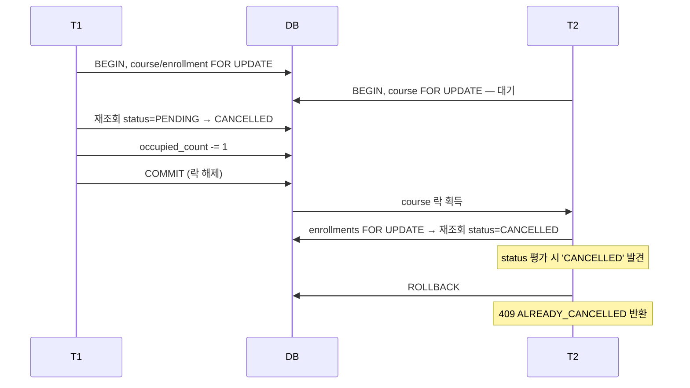
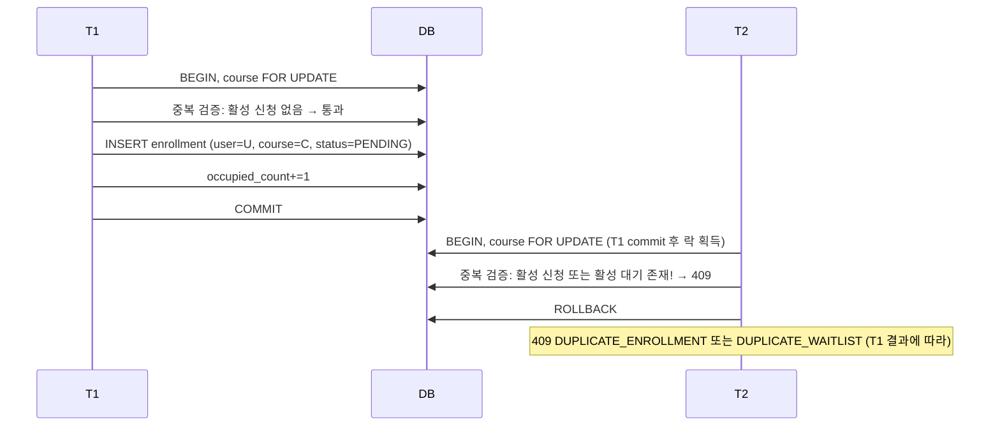

# BE-A 수강 신청 시스템 동시성 제어 흐름

> 작성일: 2026-05-21
> 대상: 라이브클래스 BE-A 채용 과제

---

## 1. 문서 목적

본 문서는 동시 요청 환경에서 도메인 정합성을 유지하는 방법을 시퀀스 단위로 명세한다. **상태 전이 단위의 락/가드 결정은 `docs/STATE_TRANSITIONS.md`에서 다루고**, 본 문서는 다음을 다룬다.

- 격리 수준 선택과 그 이유
- 트랜잭션 경계
- 락 패턴별 PostgreSQL 동작 원리
- 동시 요청 시 시퀀스 다이어그램
- Deadlock 부재 증명
- PostgreSQL 운영 고려사항
- 동시성 테스트 설계

상호 참조:
- 데이터 모델 → `docs/ERD.md`
- API 인터페이스 → `docs/API.md`
- 상태 전이 정밀 명세 → `docs/STATE_TRANSITIONS.md`

---

## 2. 전체 동시성 전략 요약

- **격리 수준**: PostgreSQL 기본인 **READ COMMITTED** 그대로 사용
- **정원 정합성**: `courses` row에 `SELECT FOR UPDATE`(PESSIMISTIC_WRITE)로 강의별 직렬화
- **상태 전이 race**: 다음 두 패턴 중 하나로 차단
  - **가드 조건 UPDATE** (`SET ... WHERE id=? AND status='<expected>'`)
  - **락 + 재조회 + 단순 UPDATE** (`SELECT FOR UPDATE` → 평가 → UPDATE)
- **락 획득 순서**: `courses → enrollments → waitlists` — 모든 트랜잭션이 동일 순서를 따라 deadlock 회피
- **자동 승격 race fallback**: 가드 영향 0이면 다음 후보를 재조회해 재시도

---

## 3. 락 전략 트레이드오프

### 3.1 결정 원칙

> **`occupied_count`가 바뀌거나 대기열 자동 승격이 필요한 흐름에는 비관적 락을 적용하고, 단일 row의 상태만 바뀌는 흐름은 가드 조건 UPDATE로 처리한다.**

모든 상태 전이에 비관적 락을 일괄 적용하지 않는다. 비관적 락은 정합성을 강하게 보장하지만 대기 비용이 있으며, 단일 row 상태 전이처럼 race를 가드 조건만으로도 차단할 수 있는 경우에는 더 가벼운 패턴이 더 적합하다.

### 3.2 세 가지 락 방식의 비용 비교

| 방식 | 비용의 성격 | 본 도메인 적합성 |
|---|---|---|
| **비관적 락** (`SELECT FOR UPDATE`) | 같은 row에 대한 다음 요청 **대기** | 정원 경합 / 다중 테이블 변경처럼 직렬화가 필수인 흐름에 적합 |
| **낙관적 락** (`@Version`) | 충돌 시 **재시도 + 사용자 실패 가능성** | 마지막 자리 경합처럼 충돌이 자주 발생하는 흐름엔 부적합 |
| **가드 조건 UPDATE** | 영향 row 0 시 **단순 분기** | PostgreSQL 단일 UPDATE의 atomic 보장 덕분에 단일 row 상태 전이에 가장 적합 |

### 3.3 낙관적 락을 본 도메인에 적용하지 않은 이유

본 시스템의 핵심 동시성 지점은 **정원 경합**이다. 정원 1명에 동시 신청 10명 시나리오를 낙관적 락으로 처리하면:

```
1명 성공
9명 → OptimisticLockException
9명 → 애플리케이션이 catch + 재시도/보상 로직을 직접 구현해야 함
재시도 시 정원이 더 이상 없으므로 Waitlist 전환 분기를 별도로 구현
```

- 사용자가 실패 경험 또는 재시도 지연을 체감
- 서버 측에서 `OptimisticLockException` 처리, 재시도 횟수 제한, Waitlist 전환 보상 로직을 모두 직접 구현해야 함
- "재시도 시 정원이 또 차 있다면 Waitlist로 전환"이라는 보상 로직 복잡도 ↑

같은 시나리오를 비관적 락으로 처리하면 한 번의 트랜잭션 안에서 정원 분기까지 마무리되며, 사용자는 `ENROLLED` 또는 `WAITLISTED` 단일 응답을 받는다. 따라서 본 과제에는 비관적 락이 더 적합하다.

### 3.4 적용 전략 표

| 구간 | 문제 성격 | 최종 선택 | 이유 |
|---|---|---|---|
| 수강 신청 / 대기 등록 | 정원 판단 + count 증가 + INSERT | **비관적 락** | 같은 강의 정원 경합을 직렬화 |
| 수강 취소 / 자동 승격 | count 감소 + waitlist 승격 + INSERT | **비관적 락 + 가드 UPDATE** | 다중 테이블 변경을 한 트랜잭션으로 묶기 위함 |
| 결제 확정 | 단일 Enrollment 상태 전이 | **가드 조건 UPDATE** | `occupied_count` 변화 없음 |
| 대기 취소 | 단일 Waitlist 상태 전이 | **가드 조건 UPDATE** | 정원 변화 없음 |
| Course `open` / `close` | 단일 Course 상태 전이 | **가드 조건 UPDATE** | 상태 전이만 검증하면 충분 |
| 조회 API | 읽기 | **락 없음** | 정합성 변경 없음 |
| 중복 활성 신청/대기 차단 | 다중 row race 방어 | **Partial Unique Index** | 애플리케이션 검증의 최종 안전망 |

### 3.5 낙관적 락 추후 도입 검토

본 과제에서는 `@Version`을 도입하지 않는다. 다만 다음 시점에는 검토 여지가 있다.

| 도입 후보 | 판단 |
|---|---|
| Course 정보 수정 (title, description 등) | 향후 정보 수정 API 추가 시 도입 검토. 정원과 무관한 일반 필드에는 낙관적 락이 가볍고 적합 |
| User 정보 수정 | 동일 |
| Enrollment confirm/cancel | 가드 조건 UPDATE가 더 단순 — 도입 불필요 |
| Waitlist cancel/promote | 가드 조건 UPDATE가 더 명확 — 도입 불필요 |

### 3.6 가드 조건 UPDATE가 락 없이도 안전한 이유

```sql
UPDATE enrollments
   SET status='CONFIRMED', confirmed_at=now(), updated_at=now()
 WHERE id=? AND status='PENDING';
```

PostgreSQL은 단일 UPDATE 문 안에서 `WHERE` 평가와 SET 변경을 atomic하게 처리한다. 두 트랜잭션이 동일 row에 가드 조건 UPDATE를 시도하면, row lock에 의해 한 쪽이 먼저 실행되고, 나머지는 변경된 상태를 본 뒤 가드가 미일치해 0 row를 반환한다. 별도 락 선언 없이도 race가 차단된다.

---

## 4. 격리 수준 결정

### 4.1 선택: READ COMMITTED

PostgreSQL 기본 격리 수준 `READ COMMITTED`를 그대로 사용한다.

### 4.2 다른 격리 수준을 검토하고 채택하지 않은 이유

| 격리 수준 | 채택 여부 | 사유 |
|---|---|---|
| `READ UNCOMMITTED` | ✗ | PostgreSQL은 실제로 `READ COMMITTED`처럼 동작(dirty read 미발생) — 의미가 없음 |
| **`READ COMMITTED` (선택)** | ✅ | 표준 OLTP 격리 수준. `SELECT FOR UPDATE`로 write-write 경합은 row lock 직렬화가 보장하므로 충분 |
| `REPEATABLE READ` | ✗ | snapshot consistency가 추가되지만, 본 도메인의 race는 row lock + 가드 조건으로 이미 차단. 대신 serialization failure 재시도 처리 복잡도가 증가 |
| `SERIALIZABLE` | ✗ | 최강 격리지만 동시성 throughput 손실. 본 도메인은 row-level 직렬화만으로 충분 |

### 4.3 결정 핵심

write-write 경합은 `SELECT FOR UPDATE`/`UPDATE` row lock으로 직렬화된다. read-write 경합에서 발생할 수 있는 phantom/non-repeatable read는 본 도메인에서 의미가 없다. 예를 들어:

- 수강 신청 시 `occupied_count`는 항상 `SELECT FOR UPDATE`로 잠긴 행에서 읽는다. 다른 트랜잭션이 같은 row를 변경 중이면 해당 트랜잭션이 commit될 때까지 대기한 뒤 **최신 commit 값**을 기준으로 판단한다.
- 가드 조건 UPDATE는 자체적으로 행 락을 획득하므로, 가드 평가와 변경이 atomic하다.

따라서 더 높은 격리 수준은 불필요한 비용.

---

## 5. 트랜잭션 경계

각 API 요청 = 하나의 트랜잭션. 트랜잭션 경계는 `@Transactional`을 서비스 메서드에 적용한다.

| API | 트랜잭션 범위 |
|---|---|
| `POST /api/courses` | INSERT 1건 |
| `POST /api/courses/{id}/open|close` | UPDATE 1건 |
| `GET /api/courses(/{id})` | 트랜잭션 없음 또는 read-only |
| `POST /api/courses/{id}/enrollments` | `courses` 락 + (`INSERT enrollment` + `UPDATE occupied_count`) **또는** (`INSERT waitlist`) |
| `POST /api/enrollments/{id}/confirm` | 가드 조건 `UPDATE enrollment` 1건 |
| `POST /api/enrollments/{id}/cancel` | `courses` 락 + `enrollments` 락 + `UPDATE enrollment` + `UPDATE occupied_count` + (선택적으로 `UPDATE waitlist` + `INSERT enrollment`) |
| `POST /api/waitlists/{id}/cancel` | 가드 조건 `UPDATE waitlist` 1건 |
| `GET /api/me/enrollments|waitlists`, `GET /api/courses/{id}/enrollments|waitlists` | read-only 트랜잭션 |

**핵심 원칙**: 한 요청의 모든 DB 변경은 단일 트랜잭션. 락은 트랜잭션 commit/rollback 시 자동 해제. 트랜잭션 안에서 외부 시스템(메일 발송 등) 호출은 하지 않음(본 과제 범위 밖이라 미고려).

---

## 6. 락 패턴별 동작 원리

본 시스템이 사용하는 세 가지 패턴.

### 6.1 SELECT FOR UPDATE (PESSIMISTIC_WRITE)

```sql
SELECT * FROM courses WHERE id = ? FOR UPDATE;
```

**PostgreSQL 동작**
- 해당 row에 row-level exclusive lock 획득
- 다른 트랜잭션의 `SELECT FOR UPDATE`, `UPDATE`, `DELETE`는 본 트랜잭션이 commit/rollback될 때까지 대기
- 단순 `SELECT`(락 없음)는 MVCC 스냅샷으로 즉시 응답 (블로킹 없음)
- 트랜잭션 종료 시 자동 해제

**JPA 사용 예**
```java
@Lock(LockModeType.PESSIMISTIC_WRITE)
@Query("SELECT c FROM Course c WHERE c.id = :id")
Optional<Course> findByIdForUpdate(@Param("id") Long id);
```

### 6.2 가드 조건 UPDATE

```sql
UPDATE enrollments
   SET status = 'CONFIRMED',
       confirmed_at = now(),
       updated_at = now()
 WHERE id = ?
   AND status = 'PENDING';
```

**PostgreSQL 동작**
- UPDATE는 자체적으로 대상 row에 lock을 잡고 변경
- `WHERE` 절이 매칭되지 않으면 0 row 영향 → 호출 코드에서 race 판단
- atomic 보장: PostgreSQL은 단일 UPDATE 문 안에서 평가와 갱신을 동시 처리하므로 race 없음

**핵심**: 두 트랜잭션이 동일 row에 가드 조건 UPDATE를 동시에 시도하면, row lock에 의해 직렬화된다. 먼저 commit한 쪽이 status를 바꾸고, 나중 트랜잭션은 가드가 더 이상 매칭되지 않아 0 row를 반환한다.

### 6.3 락 + 재조회 + 단순 UPDATE

```sql
-- 1단계
SELECT * FROM courses WHERE id = ? FOR UPDATE;
SELECT * FROM enrollments WHERE id = ? FOR UPDATE;
-- 2단계: 코드에서 status 평가
-- 3단계
UPDATE enrollments SET status = 'CANCELLED', cancelled_at=now(), updated_at=now() WHERE id = ?;
```

**언제 사용하는가**: 단일 UPDATE 가드만으로 부족한 경우 — 즉, 락 안에서 여러 row를 함께 평가/변경해야 할 때. 본 시스템에서는 **Enrollment 취소**가 이에 해당(course의 occupied_count 변경 + waitlist 자동 승격까지 한 트랜잭션에서 처리).

**왜 가드 조건 UPDATE만으로는 부족한가**: cancel은 단순 status 변경이 아니라 `occupied_count` 갱신과 후속 자동 승격까지 묶여 있다. 이들을 같은 트랜잭션 안에서 일관되게 처리하려면 `courses` row를 락으로 잡아 강의 단위 동시성을 직렬화해야 한다.

### 6.4 시간(`now()`) 처리 정책

본 문서의 SQL 예시에 등장하는 `now()`는 **의사 표현**이다. 실제 구현은 다음 정책을 따른다.

- 애플리케이션이 주입받은 `Clock` 빈에서 `OffsetDateTime`을 생성
- native UPDATE 쿼리에 DB의 `now()` 함수 대신 **파라미터(`:now`)로 전달**

**이유**

- 취소 가능 기간 경계 테스트 시 `Clock` mock으로 임의 시각 주입 가능 (DB `now()`를 직접 호출하면 mock이 무시됨)
- 단일 트랜잭션 내의 여러 UPDATE가 동일 인스턴트를 공유 (DB의 `now()`는 statement timestamp가 아니라 transaction timestamp이므로 일관되지만, Java 코드에서 명시적으로 같은 인스턴트를 주입하는 편이 더 통제하기 쉬움)
- 분산 환경 확장 시 시간 관리를 애플리케이션 레이어에 일원화

**예시**

```sql
UPDATE enrollments
   SET status='CANCELLED',
       cancelled_at = :now,
       updated_at  = :now
 WHERE id = ?;
```

서비스 코드:

```java
OffsetDateTime now = OffsetDateTime.now(clock);
enrollmentRepository.cancelById(enrollmentId, now);
```

### 6.5 JPA native UPDATE 이후 영속성 컨텍스트 처리

본 시스템은 가드 조건 UPDATE를 native query 또는 `@Query`로 직접 실행한다. 이 경우 JPA 영속성 컨텍스트(1차 캐시)에 보유된 Entity는 변경 사실을 모르므로 **stale 상태**가 된다. 본 정책은 다음과 같다.

- `@Modifying(clearAutomatically = true, flushAutomatically = true)` 옵션으로 native UPDATE 후 영속성 컨텍스트를 자동 clear
- 응답 DTO를 만들 때는 **변경 후 fresh select**로 다시 조회 (1차 캐시의 stale entity에 의존하지 않음)
- 사용자에게 반환하는 시점의 상태는 항상 DB 최신 commit 기준

**예시**

```java
@Modifying(clearAutomatically = true, flushAutomatically = true)
@Query("UPDATE Enrollment e SET e.status='CANCELLED', e.cancelledAt=:now, e.updatedAt=:now WHERE e.id=:id")
int cancelById(@Param("id") Long id, @Param("now") OffsetDateTime now);
```

서비스 코드:

```java
int affected = enrollmentRepository.cancelById(id, now);
if (affected == 0) { throw new AlreadyCancelledException(); }
// fresh select로 응답 DTO 구성 — 1차 캐시는 clearAutomatically로 비워진 상태
Enrollment refreshed = enrollmentRepository.findById(id).orElseThrow();
return EnrollmentResponse.from(refreshed);
```

---

## 7. 시나리오별 동시성 분석

가장 중요한 race 패턴을 sequence diagram으로 정리.

### 7.1 마지막 한 자리 경합 (수강 신청 vs 수강 신청)

**상황**: capacity=10, occupied_count=9. 두 명이 동시에 신청.



**결과**: 정원 정확히 10명, B는 waitlist position=1. 정원 초과 발생 불가.

### 7.2 결제 확정 vs 수강 취소 (동일 enrollment)

**상황**: 같은 enrollment(PENDING)에 confirm과 cancel을 동시에 호출.

**cancel 흐름의 사전 단계**: cancel은 `enrollments` row를 먼저 **non-locking read**로 조회해 `course_id`와 소유권을 사전 확인한 뒤 본격 락 흐름에 들어간다. 이 첫 read는 라우팅·사전 확인용이며 stale 값일 수 있으므로 권위 있는 검증이 아니다. **권위 있는 상태 검증은 `SELECT FOR UPDATE`로 락을 획득한 뒤의 재조회에서 수행**한다.



**역순 시나리오: confirm이 먼저 enrollment 변경을 시작한 경우**

`cancel`은 course lock을 보유 중이지만 `confirm`은 course lock을 사용하지 않는다. 따라서 `cancel`이 enrollment lock을 획득하기 전에 `confirm`이 enrollment row에 먼저 UPDATE를 시도할 수 있다.

- T1(confirm): `UPDATE enrollments SET status='CONFIRMED' ... WHERE id=? AND status='PENDING'` → enrollment row의 implicit lock 획득 → commit
- T2(cancel): `SELECT FOR UPDATE enrollments` 대기 → T1 commit 후 락 획득 → 재조회 시 `status='CONFIRMED'` 발견
- T2(cancel)은 `CONFIRMED → CANCELLED` 전이로 진행 (`confirmed_at + N일` 기간 내 조건 충족 시)

즉, 양쪽 순서 모두 정상 처리되며 최종 상태는 `CANCELLED`이다.

**기대 결과 정리**

도착 순서와 기간 조건에 따라 다음 세 가지가 모두 정상 흐름이다.

| 순서 | confirm 결과 | cancel 결과 | 최종 상태 |
|---|---|---|---|
| cancel 먼저 commit | 409 `INVALID_STATUS` | 200 OK | `CANCELLED` |
| confirm 먼저 commit + 기간 내 cancel | 200 OK | 200 OK | `CANCELLED` |
| confirm 먼저 commit + 기간 초과 cancel | 200 OK | 409 `CANCEL_DEADLINE_EXCEEDED` | `CONFIRMED` |

**불변식**: 어떤 도착 순서에서도 `occupied_count`는 일관되며, 결제와 취소가 동시에 성공하면서 `occupied_count`가 깨지는 시나리오는 발생하지 않는다.

### 7.3 자동 승격 vs 대기 취소 (동일 waitlist)

**상황**: User B가 WAITING 중. User A가 enrollment를 취소해 자동 승격이 발동되는 순간, User B가 본인 대기를 취소.



**역순(T1이 먼저 PROMOTED)인 경우**: T2의 가드가 미일치 → 영향 0 → `409 INVALID_STATUS` 반환 (B 입장에서는 "이미 승격되어 취소 불가"라는 메시지).

### 7.4 동일 enrollment 중복 취소 (사용자 두 번 클릭)

**상황**: 같은 사용자가 cancel을 빠르게 두 번 호출.



**핵심**: course 락에 의해 직렬화되므로 두 번째 요청은 정확히 `ALREADY_CANCELLED`로 거부된다. 중복 occupied_count 감소가 발생하지 않는다.

### 7.5 동일 사용자의 동시 신청 (race)

**상황**: 같은 사용자가 동일 강의에 동시에 두 번 신청. partial unique index가 차단해야 한다.



course 락 직렬화 덕분에 두 번째 트랜잭션의 서비스 검증 단계에서 차단된다. 반환되는 에러는 T1의 결과에 따라 갈린다 — T1이 ENROLLED로 끝났다면 T2는 `DUPLICATE_ENROLLMENT`, T1이 WAITLISTED로 끝났다면 T2는 `DUPLICATE_WAITLIST`. 다만 **검증 누락**이 코드에 있어도 DB의 `uq_active_enrollment_per_user_course` 및 `uq_waiting_waitlist_per_user_course` partial unique index가 INSERT를 거부하므로 정합성은 유지된다(2중 방어).

---

## 8. Deadlock 분석

### 8.1 락 획득 순서 규칙

본 시스템의 모든 트랜잭션은 다음 순서로 락을 획득한다.

```
courses → enrollments → waitlists
```

이 규칙을 어기는 코드 경로가 존재하지 않는 한, deadlock 가능성은 낮은 수준으로 유지된다.

### 8.2 모든 동시성 경로의 락 사용 매트릭스

| 트랜잭션 종류 | 1차 락 | 2차 락 | 3차 락 |
|---|---|---|---|
| 강의 등록/상태 변경 | courses(단일 row) | — | — |
| 수강 신청 (direct/waitlist) | courses | (INSERT only) | (INSERT only) |
| 결제 확정 | (가드 UPDATE → 자체 row lock) | — | — |
| 수강 취소 | courses | enrollments | (자동 승격 시 waitlist 가드 UPDATE) |
| 대기 취소 | (가드 UPDATE → 자체 row lock) | — | — |

순서 위반 경로 없음. 따라서 **현재 정의된 쓰기 경로에서는 deadlock 가능성이 낮다.** (DB 환경 특성상 절대적 부재를 단정하기는 어려우며, 향후 새 쓰기 경로를 추가할 때 동일한 락 순서를 유지하면 위험을 낮은 수준으로 유지할 수 있다.)

### 8.3 잠재 deadlock 후보 검토

검토할 만한 시나리오들과 결론:

| 시나리오 | 결론 |
|---|---|
| 두 트랜잭션이 서로 다른 course를 변경 | 락 경합 없음 → deadlock 불가 |
| 두 트랜잭션이 동일 course에서 동시 cancel | 둘 다 course 락을 같은 순서로 시도 → 한 쪽 직렬화 |
| cancel ↔ confirm | confirm은 row UPDATE만, cancel은 course → enrollment 락. confirm의 UPDATE는 enrollment row lock을 짧게 잡고 끝나므로 cancel과 cycle 형성 불가 |
| cancel ↔ 대기 취소 (다른 waitlist row) | 다른 row, 다른 트랜잭션의 lock dependency 없음 |
| cancel(자동 승격) ↔ 대기 취소(동일 waitlist) | 같은 waitlist row 경합 → row lock 직렬화. cycle 없음 |

### 8.4 잠금 대기 타임아웃

PostgreSQL은 기본적으로 무한 대기. 운영 환경에서는 `SET lock_timeout = '3s'`처럼 설정해 무한 대기를 방지하는 것이 일반적이다.

**본 과제 구현에서는 별도의 `lock_timeout`을 설정하지 않는다.** 단일 인스턴스 + 짧은 트랜잭션 환경에서 실측 가능한 락 대기 케이스가 거의 없고, 추가 설정 시 API 에러 매트릭스에 `LOCK_TIMEOUT` 코드도 새로 정의해야 하므로 과제 범위를 줄이는 차원에서 보류. 운영 확장 시 검토 항목.

---

## 9. PostgreSQL 특유 동작과 옵션

### 9.1 SELECT FOR UPDATE의 변형

| 옵션 | 동작 | 본 시스템 사용 |
|---|---|---|
| `FOR UPDATE` | 다른 트랜잭션의 변경/락을 대기 | ✅ courses, enrollments 락에 사용 |
| `FOR UPDATE NOWAIT` | 락 잡혀 있으면 즉시 예외 | ✗ 본 도메인은 대기 허용 |
| `FOR UPDATE SKIP LOCKED` | 잡힌 row를 건너뛰고 다음 row 반환 | ✗ 검토 후 미사용 (아래 참조) |
| `FOR SHARE` | 공유 락 (다른 쓰기 차단, 다른 share read는 허용) | ✗ 필요 없음 |

### 9.2 `SKIP LOCKED`를 자동 승격에 사용하지 않은 이유

`SKIP LOCKED`는 잡힌 row를 건너뛰는 큐 처리 패턴이다. 본 시스템의 자동 승격은:

- 동일 트랜잭션이 이미 course 락을 보유 → 다른 트랜잭션과 동일 course의 동시 승격은 직렬화됨
- waitlist의 동시 cancel은 가드 조건 UPDATE의 fallback으로 처리

따라서 `SKIP LOCKED`의 이점(대기 없는 큐 처리)이 필요하지 않다. **단순한 가드 + fallback 패턴이 더 명료**하고 PostgreSQL 기본 동작에 의존하지 않으므로 채택.

### 9.3 자동 commit 시 row 락 해제

`@Transactional` 메서드가 정상 종료(commit) 또는 예외(rollback) 시 PostgreSQL이 모든 row 락을 자동 해제한다. Connection pool에 반환되어도 락은 트랜잭션 단위로 관리되므로 leak 없음.

### 9.4 Long Transaction 회피

긴 트랜잭션 안에서 외부 HTTP 호출 등을 수행하면 락이 오래 잡혀 throughput이 떨어진다. 본 과제 범위에서는 외부 호출이 없지만, 향후 결제 PG 연동 등을 추가할 때는 트랜잭션 안에서 호출하지 않고, 별도의 상태(`PAYMENT_PROCESSING` 등)와 비동기 콜백 패턴을 도입해야 함을 명시한다.

### 9.5 DB Unique Violation → 도메인 에러 매핑

서비스 레이어의 중복 검증이 어떤 이유로든 우회되더라도, partial unique index가 INSERT를 거부해 정합성을 지킨다(2중 방어). 이때 PostgreSQL은 SQLSTATE `23505`(unique violation)를 던지고, Spring은 `DataIntegrityViolationException`으로 래핑한다. 이를 도메인 에러로 매핑하는 정책은 다음과 같다.

| 위반 인덱스 | 매핑 코드 | HTTP | 비고 |
|---|---|---|---|
| `uq_active_enrollment_per_user_course` | `DUPLICATE_ENROLLMENT` | 409 | 같은 사용자가 이미 활성 신청을 가짐 |
| `uq_waiting_waitlist_per_user_course` | `DUPLICATE_WAITLIST` | 409 | 같은 사용자가 이미 활성 대기를 가짐 |
| `uq_enrollments_promoted_from_waitlist` | `INTERNAL_ERROR` | 500 | 정상 흐름에서 발생 불가. 코드 버그 시그널이므로 500. 로그에 인덱스 이름을 남겨 디버깅 단서로 사용 |

매핑은 `@ControllerAdvice`에서 `DataIntegrityViolationException`을 가로채 SQLState/constraint name으로 분기하는 형태로 구현한다. 상세 매핑 규칙과 메시지 템플릿은 `docs/ERROR_CODES.md`에서 다룬다.

---

## 10. 동시성 테스트 설계

### 10.1 핵심 테스트 시나리오

| # | 시나리오 | 검증 항목 |
|---|---|---|
| 1 | 마지막 한 자리 경합 (capacity 10, 동시 신청 50) | enrollment=10, waitlist=40, occupied_count=10. 초과 없음 |
| 2 | confirm ↔ cancel race | 둘 중 하나만 성공, 다른 한쪽 409 |
| 3 | 자동 승격 ↔ 대기 취소 race | 정확히 한 명만 승격, 나머지는 본인 의도대로 취소 |
| 4 | 같은 사용자 동시 신청 | 1건만 성공, 나머지 DUPLICATE_ENROLLMENT |
| 5 | 같은 enrollment 중복 cancel | 1건만 성공, 나머지 ALREADY_CANCELLED |
| 6 | 동시 다중 cancel → 다중 자동 승격 | 각 cancel당 1명씩 승격, occupied_count 정확 |
| 7 | CLOSED 강의의 동시 cancel | 모두 occupied_count 감소만, 승격 발동 없음 |

### 10.2 테스트 구현 패턴

JUnit 5 + Testcontainers PostgreSQL + `CountDownLatch` + `ExecutorService` 조합.

```java
@SpringBootTest
@AutoConfigureTestcontainers
class EnrollmentConcurrencyTest {

    @Autowired EnrollmentService service;
    @Autowired CourseRepository courseRepo;

    @Test
    void 마지막_한_자리_경합_정원_초과_없음() throws Exception {
        // given
        Course c = courseRepo.save(...); // capacity=10, status=OPEN
        int participantCount = 50;
        CountDownLatch start = new CountDownLatch(1);
        CountDownLatch done = new CountDownLatch(participantCount);
        ExecutorService pool = Executors.newFixedThreadPool(participantCount);

        AtomicInteger enrolled = new AtomicInteger();
        AtomicInteger waitlisted = new AtomicInteger();

        // when
        for (long userId = 1; userId <= participantCount; userId++) {
            final long uid = userId;
            pool.submit(() -> {
                try {
                    start.await();  // 모든 스레드를 동일 시점에 발사
                    EnrollmentResult r = service.enroll(c.getId(), uid);
                    if (r.outcome() == ENROLLED) enrolled.incrementAndGet();
                    else waitlisted.incrementAndGet();
                } catch (Exception e) {
                    // 기록
                } finally {
                    done.countDown();
                }
            });
        }
        start.countDown();
        done.await(30, TimeUnit.SECONDS);

        // then
        Course refreshed = courseRepo.findById(c.getId()).orElseThrow();
        assertThat(refreshed.getOccupiedCount()).isEqualTo(10);
        assertThat(enrolled.get()).isEqualTo(10);
        assertThat(waitlisted.get()).isEqualTo(40);
    }
}
```

### 10.3 검증 항목 체크리스트

- [ ] `occupied_count`가 capacity를 초과하지 않음
- [ ] `enrollment` 총수가 `occupied_count`와 일치 (`status IN ('PENDING','CONFIRMED')` 기준)
- [ ] `waitlist` 총수가 `(participantCount - capacity)`와 일치
- [ ] 어떤 사용자도 중복 활성 신청이나 중복 활성 대기를 갖지 않음
- [ ] 자동 승격된 enrollment의 `promoted_from_waitlist_id`가 NULL이 아니며 해당 waitlist는 `PROMOTED` 상태

### 10.4 테스트 격리

각 동시성 테스트는 독립된 트랜잭션 컨텍스트에서 실행되어야 한다. `@Transactional`로 감싸지 말고(테스트 안에서 commit이 필요), 대신 `@AfterEach`에서 명시적으로 데이터 정리(`DELETE FROM enrollments; DELETE FROM waitlists; DELETE FROM courses; DELETE FROM users;`) 또는 Testcontainers의 컨테이너 재사용 + truncate 패턴 사용.

---

## 11. 운영 고려사항

### 11.1 락 대기 모니터링

운영 환경에서는 다음 PostgreSQL 시스템 뷰로 락 대기를 모니터링한다.

```sql
SELECT pid, locktype, mode, granted, query
  FROM pg_locks
  JOIN pg_stat_activity USING (pid)
 WHERE NOT granted;
```

본 과제 범위에서는 운영 환경 구축이 아니므로 모니터링 자체는 구현하지 않지만, 향후 확장 시 활용 가능.

### 11.2 트랜잭션 타임아웃

Spring의 `@Transactional(timeout = 10)`으로 트랜잭션 자체 타임아웃 설정 가능. 본 과제에서는 단일 인스턴스 + 짧은 트랜잭션이므로 디폴트(무제한)를 사용해도 무방하지만, 명시적 타임아웃은 안전망이 된다.

### 11.3 알려진 한계와 미래 개선

| 한계 | 본 과제 대응 | 향후 개선 방향 |
|---|---|---|
| 단일 PostgreSQL primary 전제 | 본 락 전략은 단일 primary DB를 가정. 애플리케이션 인스턴스 수와는 무관(row lock은 DB-level이므로 다중 app 인스턴스에서도 그대로 동작) | read replica 도입 시 쓰기는 primary로만 라우팅. 분산 캐시 도입 시 캐시-DB 정합성을 위한 별도 분산 락 검토 필요 |
| 인기 강의 hotspot | 단일 course row 락이 직렬화 병목 | 시간대 분산(early-bird), 큐 기반 처리, 카운터 샤딩 등 검토 |
| 자동 승격 batch 처리 | 한 cancel에 한 명만 승격 | 대규모 cancel batch는 별도 작업으로 분리 |
| 결제 PG 외부 연동 | 본 과제 범위 외 | 트랜잭션 안에서 외부 호출 금지. 별도 상태(`PAYMENT_PROCESSING`) + 비동기 콜백 |

---

## 12. 구현 체크리스트

본 문서를 코드에 옮길 때 확인할 항목.

- [ ] `@Transactional` 적용 범위가 서비스 메서드 1개 = 1 트랜잭션인지 확인
- [ ] `CourseRepository.findByIdForUpdate`처럼 명시적 PESSIMISTIC_WRITE 메서드 정의
- [ ] 락 획득 순서: 코드 리뷰 단계에서 `courses → enrollments → waitlists` 순서 위반 없는지 확인
- [ ] 자동 승격 fallback 루프: 후보가 없을 때 종료 조건 명확
- [ ] 본 과제 구현에서는 `lock_timeout`을 별도로 설정하지 않음. 운영 확장 시 도입 검토 항목으로 README에 기록
- [ ] 동시성 테스트가 Testcontainers의 실제 PostgreSQL에서 동작 (H2 금지)
- [ ] 테스트 격리: 각 테스트 종료 시 명시적 데이터 정리
- [ ] long transaction 회피: 트랜잭션 안에서 외부 HTTP/IO 호출 없음
