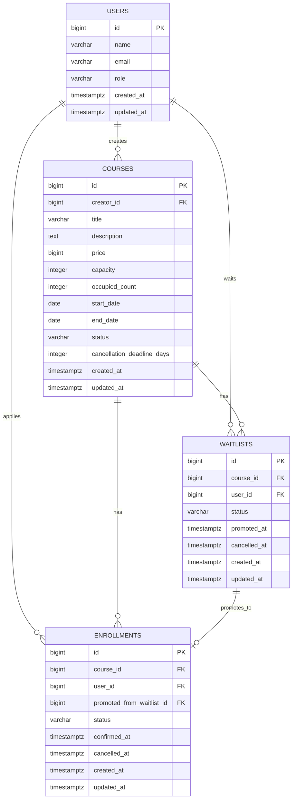

# BE-A 수강 신청 시스템 ERD 설계

## 1. 설계 방향

이번 과제는 단순 CRUD보다 상태 전이, 정원 관리, 동시성 제어가 핵심이다. 선택 구현까지 모두 포함하기 위해 다음 4개 테이블로 설계한다.

```
users
courses
enrollments
waitlists
```

| 테이블 | 역할 |
|---|---|
| users | 목데이터 기반 사용자 관리. CREATOR, STUDENT 역할 구분 |
| courses | 강의 정보, 정원, 현재 점유 인원, 모집 상태 관리 |
| enrollments | 실제 수강 신청, 결제 확정, 취소 상태 관리 |
| waitlists | 정원 초과 시 대기 등록, 취소 발생 시 자동 승격 관리 |

---

## 2. 테이블 설계

### users

```
users
- id BIGINT PK
- name VARCHAR(50) NOT NULL
- email VARCHAR(100) NOT NULL
- role VARCHAR(20) NOT NULL
- created_at TIMESTAMPTZ NOT NULL
- updated_at TIMESTAMPTZ NOT NULL
```

`users`는 실제 회원가입/로그인용 테이블이 아니다. 과제에서 인증/인가는 간략히 처리 가능하므로, API 요청에서는 `X-USER-ID` 헤더로 현재 사용자를 식별하고 `users.role`로 크리에이터와 수강생을 구분한다.

- `CREATOR`: 강의 개설 가능
- `STUDENT`: 수강 신청 가능

### courses

```
courses
- id BIGINT PK
- creator_id BIGINT FK -> users.id
- title VARCHAR(100) NOT NULL
- description TEXT
- price BIGINT NOT NULL
- capacity INTEGER NOT NULL
- occupied_count INTEGER NOT NULL DEFAULT 0
- start_date DATE NOT NULL
- end_date DATE NOT NULL
- status VARCHAR(20) NOT NULL
- cancellation_deadline_days INTEGER NOT NULL DEFAULT 7
- created_at TIMESTAMPTZ NOT NULL
- updated_at TIMESTAMPTZ NOT NULL
```

`courses`는 강의 기본 정보와 모집 상태를 관리한다.

`capacity`는 최대 수강 가능 인원이고, `occupied_count`는 현재 정원을 점유 중인 신청 수다.

정원 점유 기준:

```
PENDING   -> 점유
CONFIRMED -> 점유
CANCELLED -> 미점유
```

즉, 결제 대기 상태인 `PENDING`도 자리를 점유한다. 그래야 결제 확정 시점에 정원이 초과되는 문제를 막을 수 있다.

강의 상태:

```
DRAFT  -> 초안, 신청 불가
OPEN   -> 모집 중, 신청 가능
CLOSED -> 모집 마감, 신청 불가
```

### enrollments

```
enrollments
- id BIGINT PK
- course_id BIGINT FK -> courses.id
- user_id BIGINT FK -> users.id
- promoted_from_waitlist_id BIGINT NULL FK -> waitlists.id
- status VARCHAR(20) NOT NULL
- confirmed_at TIMESTAMPTZ NULL
- cancelled_at TIMESTAMPTZ NULL
- created_at TIMESTAMPTZ NOT NULL
- updated_at TIMESTAMPTZ NOT NULL
```

`enrollments`는 실제 수강 신청 데이터를 관리한다.

신청 상태:

```
PENDING   -> 신청 완료, 결제 대기
CONFIRMED -> 결제 완료, 수강 확정
CANCELLED -> 취소됨
```

허용 상태 전이:

```
PENDING -> CONFIRMED
PENDING -> CANCELLED
CONFIRMED -> CANCELLED
```

허용하지 않는 전이:

```
CANCELLED -> CONFIRMED
CONFIRMED -> PENDING
CANCELLED -> PENDING
```

`promoted_from_waitlist_id`는 대기열에서 자동 승격되어 생성된 신청인지 추적하기 위한 컬럼이다. 직접 신청이면 NULL, 대기열 승격이면 해당 `waitlists.id`를 저장한다.

### waitlists

```
waitlists
- id BIGINT PK
- course_id BIGINT FK -> courses.id
- user_id BIGINT FK -> users.id
- status VARCHAR(20) NOT NULL
- promoted_at TIMESTAMPTZ NULL
- cancelled_at TIMESTAMPTZ NULL
- created_at TIMESTAMPTZ NOT NULL
- updated_at TIMESTAMPTZ NOT NULL
```

`waitlists`는 정원이 찬 강의에 신청한 사용자를 관리한다.

대기 상태:

```
WAITING   -> 대기 중
PROMOTED  -> 수강 신청으로 승격됨
CANCELLED -> 대기 취소
```

허용 상태 전이:

```
WAITING -> PROMOTED
WAITING -> CANCELLED
```

대기 순서는 별도 `position` 컬럼으로 저장하지 않는다. 중간 대기자가 취소되면 순번 재정렬 문제가 생기기 때문이다.

대신 조회 시점에 아래 기준으로 순서를 계산한다.

```
created_at ASC, id ASC
```

---

## 3. Mermaid ERD



---

## 4. 관계 정리

```
users 1 - N courses
users 1 - N enrollments
users 1 - N waitlists

courses 1 - N enrollments
courses 1 - N waitlists
waitlists 1 - 0..1 enrollments
```

의미:

- 한 명의 CREATOR는 여러 강의를 만들 수 있다.
- 한 명의 STUDENT는 여러 강의에 신청할 수 있다.
- 한 명의 STUDENT는 여러 강의의 대기열에 등록될 수 있다.
- 하나의 강의는 여러 수강 신청을 가질 수 있다.
- 하나의 강의는 여러 대기자를 가질 수 있다.
- 하나의 대기열은 승격 시 하나의 수강 신청으로 연결될 수 있다.

---

## 5. Enum 정리

```
UserRole
- CREATOR
- STUDENT

CourseStatus
- DRAFT
- OPEN
- CLOSED

EnrollmentStatus
- PENDING
- CONFIRMED
- CANCELLED

WaitlistStatus
- WAITING
- PROMOTED
- CANCELLED
```

---

## 6. 핵심 비즈니스 정책

### 정원 점유 기준

```
occupied_count = PENDING + CONFIRMED 상태의 Enrollment 수
```

`PENDING`도 점유로 보는 이유는 결제 대기 중인 사용자의 자리를 보장하기 위해서다.

### 수강 신청

정원이 남은 경우:

1. Course row를 `SELECT FOR UPDATE`로 잠근다.
2. 강의 상태가 `OPEN`인지 확인한다.
3. 중복 신청/대기 여부를 확인한다.
4. `occupied_count < capacity`이면 `Enrollment(PENDING)`을 생성한다.
5. `occupied_count`를 1 증가시킨다.
6. 응답은 `ENROLLED`로 내려준다.

정원이 찬 경우:

1. `Enrollment`는 생성하지 않는다.
2. `Waitlist(WAITING)`를 생성한다.
3. `occupied_count`는 증가시키지 않는다.
4. 응답은 `WAITLISTED`로 내려준다.

대기열 기능을 구현하므로 "정원 초과 시 신청 불가"는 다음처럼 해석한다.

- 정원 내 실제 수강 신청은 불가하다.
- 대신 대기열 등록은 가능하다.

### 결제 확정

1. `Enrollment`를 조회한다.
2. 본인 신청인지 확인한다.
3. 상태가 `PENDING`인지 확인한다.
4. `CONFIRMED`로 변경한다.
5. `confirmed_at`을 기록한다.

결제 확정 시 `occupied_count`는 변경하지 않는다.

- `PENDING` 생성 시 이미 `occupied_count` 증가
- `PENDING -> CONFIRMED` 시 `occupied_count` 변화 없음

### 수강 취소

1. `Enrollment`를 조회한다.
2. 본인 신청인지 확인한다.
3. Course row를 `SELECT FOR UPDATE`로 잠근다.
4. `Enrollment` 상태가 `PENDING` 또는 `CONFIRMED`인지 확인한다.
5. `CONFIRMED`인 경우 `confirmed_at` 기준 취소 가능 기간을 확인한다.
6. `Enrollment`를 `CANCELLED`로 변경한다.
7. `occupied_count`를 1 감소시킨다.
8. `course.status`가 `OPEN`이면 `WAITING` 대기자 중 가장 오래된 1명을 조회한다.
9. 대기자가 있으면 `Enrollment(PENDING)`을 생성한다.
10. 해당 `Waitlist`를 `PROMOTED`로 변경하고 `promoted_at`을 기록하며, 생성된 `Enrollment`의 `promoted_from_waitlist_id`에 해당 `Waitlist.id`를 저장한다.
11. `occupied_count`를 다시 1 증가시킨다.

강의가 `CLOSED` 상태라도 `occupied_count` 감소(7단계)는 그대로 수행한다. 다만 모집 마감 상태이므로 신규 신청과 대기자 자동 승격(8~11단계)은 모두 허용하지 않는다.

### 취소 가능 기간

- `PENDING` 상태는 결제 전이므로 언제든 취소 가능
- `CONFIRMED` 상태는 `confirmed_at` 기준 `cancellation_deadline_days` 이내에만 취소 가능

기본값은 7일이다.

---

## 7. 제약조건

```
-- users
email UNIQUE
role IN ('CREATOR', 'STUDENT')

-- courses
price >= 0
capacity > 0
occupied_count >= 0
start_date <= end_date
status IN ('DRAFT', 'OPEN', 'CLOSED')
cancellation_deadline_days >= 0

-- enrollments
status IN ('PENDING', 'CONFIRMED', 'CANCELLED')

-- waitlists
status IN ('WAITING', 'PROMOTED', 'CANCELLED')
```

`occupied_count <= capacity` 불변식은 DB CHECK 제약이 아닌 서비스 레이어에서 `PESSIMISTIC_WRITE` 락 하에 검증한다. 동일한 비즈니스 규칙을 코드와 DDL 양쪽에 중복으로 두지 않고, 정원 관리 로직을 서비스 단일 지점에 모으기 위함이다.

중복 활성 신청 방지:

```sql
CREATE UNIQUE INDEX uq_active_enrollment_per_user_course
ON enrollments(user_id, course_id)
WHERE status IN ('PENDING', 'CONFIRMED');
```

중복 대기 방지:

```sql
CREATE UNIQUE INDEX uq_waiting_waitlist_per_user_course
ON waitlists(user_id, course_id)
WHERE status = 'WAITING';
```

대기열 승격 중복 방지:

```sql
CREATE UNIQUE INDEX uq_enrollments_promoted_from_waitlist
ON enrollments(promoted_from_waitlist_id)
WHERE promoted_from_waitlist_id IS NOT NULL;
```

하나의 `Waitlist` row가 두 번 승격되어 두 개의 `Enrollment`가 생기는 시나리오를 DB 레벨에서 차단한다. 코드 버그나 트랜잭션 경계 실수가 데이터로 새지 않게 막는 안전망이다.

---

## 8. 인덱스 설계

### 설계 기준

이번 과제의 인덱스는 모든 컬럼에 무작정 추가하지 않고, 실제 API 조회 패턴과 데이터 정합성 규칙을 기준으로 설계했다.

복합 인덱스는 다음 원칙으로 구성했다.

1. 동등 조건(`=`) 컬럼을 먼저, 범위 조건(`<`, `>`, `BETWEEN`) 컬럼을 다음, 정렬 컬럼을 마지막에 배치한다.
2. `ORDER BY` 방향과 동일한 정렬 방향으로 인덱스를 정의한다. (예: 페이지네이션이 `created_at DESC` 기준이면 인덱스도 `DESC`)
3. `created_at` 동률 발생 시 페이지네이션의 안정성을 위해 `id`를 보조 정렬 키로 함께 둔다.
4. 단일 컬럼 인덱스는 복합 인덱스의 leftmost prefix가 동일한 경우 별도로 생성하지 않는다.
5. PostgreSQL은 FK 컬럼에 자동 인덱스를 생성하지 않으므로, 모든 FK 컬럼이 복합 인덱스의 prefix에 포함되도록 배치했다.
6. 상태에 따라 중복 허용 여부가 달라지는 경우, PostgreSQL partial unique index를 사용한다.

특히 수강 신청과 대기열은 상태에 따라 중복 허용 정책이 달라진다. 따라서 일반 unique index가 아니라 partial unique index를 사용했고, 이는 정책 표현인 동시에 동시 INSERT 시 race를 DB 레벨에서 차단하는 안전망 역할도 한다.

- `enrollments`: `PENDING`, `CONFIRMED` 상태에서는 동일 사용자/동일 강의 중복 신청 금지
- `waitlists`: `WAITING` 상태에서는 동일 사용자/동일 강의 중복 대기 금지

커버링 인덱스는 이번 과제 범위에서는 도입하지 않았다. 데이터 규모가 크지 않고, 과제의 핵심이 조회 최적화보다 상태 전이와 동시성 제어에 있기 때문이다. 다만 강의 목록 조회 트래픽이 커지고 응답 컬럼이 제한된다면 PostgreSQL의 `INCLUDE`를 활용한 Index Only Scan을 추가로 고려할 수 있다.

### 인덱스 정의

```sql
CREATE UNIQUE INDEX uq_users_email
ON users(email);

CREATE INDEX idx_courses_status_created
ON courses(status, created_at DESC, id DESC);

CREATE INDEX idx_courses_creator_id
ON courses(creator_id);

CREATE UNIQUE INDEX uq_active_enrollment_per_user_course
ON enrollments(user_id, course_id)
WHERE status IN ('PENDING', 'CONFIRMED');

CREATE INDEX idx_enrollments_user_created
ON enrollments(user_id, created_at DESC, id DESC);

CREATE INDEX idx_enrollments_course_status_created
ON enrollments(course_id, status, created_at DESC, id DESC);

CREATE UNIQUE INDEX uq_enrollments_promoted_from_waitlist
ON enrollments(promoted_from_waitlist_id)
WHERE promoted_from_waitlist_id IS NOT NULL;

CREATE UNIQUE INDEX uq_waiting_waitlist_per_user_course
ON waitlists(user_id, course_id)
WHERE status = 'WAITING';

CREATE INDEX idx_waitlists_course_status_created
ON waitlists(course_id, status, created_at ASC, id ASC);
```

---

## 9. 마이그레이션 적용 순서

`enrollments.promoted_from_waitlist_id`가 `waitlists.id`를 참조하므로, Flyway 마이그레이션에서 테이블 생성 순서는 다음과 같이 정해진다.

```
users → courses → waitlists → enrollments
```

`waitlists`는 반드시 `enrollments`보다 먼저 생성되어야 한다. 순환 FK는 존재하지 않으므로 `ALTER TABLE`로 FK를 분리할 필요는 없으며, 모든 인덱스는 대상 테이블 생성 직후에 적용한다.

---

## 10. 최종 설계 결정 요약

1. `users`는 실제 인증 시스템이 아니라 목데이터 기반 역할 구분용으로 둔다.
2. `courses`는 `occupied_count`로 정원 점유 수를 관리한다.
3. `occupied_count`는 반드시 Course row에 비관적 락을 획득한 트랜잭션 안에서만 변경한다.
4. `enrollments`는 실제 수강 신청과 결제/취소 상태 전이를 관리한다.
5. `waitlists`는 정원 초과 시 대기 등록과 자동 승격을 관리한다.
6. 대기열 순서는 `position` 없이 `created_at ASC, id ASC` 기준으로 계산한다.
7. `CLOSED` 강의에서는 신규 신청과 대기자 자동 승격을 모두 허용하지 않는다.
8. `occupied_count <= capacity` 불변식은 DB CHECK 제약이 아닌 서비스 레이어에서 비관적 락 하에 검증한다. 동일한 비즈니스 규칙을 코드와 DDL 양쪽에 중복으로 두지 않고, 정원 관리 로직을 서비스 단일 지점에 모으기 위함이다. 트래픽이 늘거나 다중 진입점이 추가되는 고도화 시점에는 안전망으로 CHECK 제약을 추가 도입할 수 있다.
9. UNIQUE/Partial UNIQUE 인덱스는 다중 row race를 DB 레벨에서 차단하는 안전망이자 조회 효율 자산이므로 유지한다.
10. `price`는 원화(KRW) 기준으로 `BIGINT`를 사용한다. 소수점 단위가 없는 통화 도메인이라 정수 표현이 가장 단순하고, JPA `Long` 매핑과 산술 연산에서 부동소수 이슈가 없다. 다국가 통화 확장이 필요해지면 `NUMERIC` + `currency` 컬럼 분리로 확장 가능하다.
11. 시간 컬럼은 모두 `TIMESTAMPTZ`로 저장하며 PostgreSQL이 내부적으로 UTC로 정규화한다. DB 세션 타임존은 `Asia/Seoul`로 설정해 API 응답은 KST(`+09:00`) 기준으로 제공한다. 다국가 확장 시 저장 데이터는 그대로 두고 응답 타임존만 조정하면 된다.
